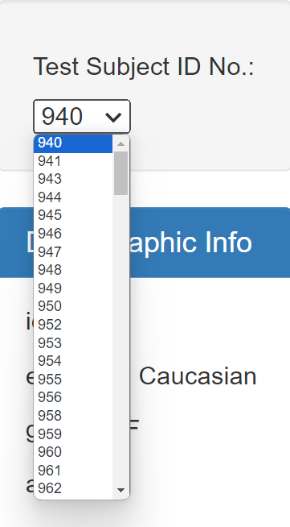

# Belly Button Challenge

## Summary:

This repository explores the [Belly Button Biodiversity Database](https://robdunnlab.com/projects/belly-button-biodiversity/), which explores one of the most diverse and mysterious habitats on earth: the human belly button. The study utilized taxonomic data from belly button swabs of 152 subjects to compare the populations of various microflora, and establish the effect of variables such as number of belly button washes per week on the variety and distribution of these microbes. The resulting JSON dataset can be found [HERE](https://2u-data-curriculum-team.s3.amazonaws.com/dataviz-classroom/v1.1/14-Interactive-Web-Visualizations/02-Homework/samples.json)

The website created by this repository, hosted at [This "Github Pages" Page](https://stwoodbury.github.io/belly-button-challenge/), allows users to explore the dataset through use of a dropdown menu, populated by each of the research subjects' id numbers. Users are able to view the following data for each selected subject:

 <ol>
    <li>The subject's demographic data <i>(including ethnicity, age, gender, location, belly button type("innie/outie"), and the frequency with which they wash their belly buttons)</i></li> 
    <li>A bar graph outlining the top 10 microbes observed in the sample<i>(by population)</i></li>
    <li>A bubble chart, illustrating all microbes observed in the sample<i>(with size and color of bubbles corresponding to population and taxonomy, respectively)</i></li>
    <li>A gauge chart, illustrating the subjects' wash frequency</li>
</ol>

## Coding Methodology:

### Summary:
This analysis uses the following tools to create interactive charts and to allow the user to explore the data through the [Website](https://stwoodbury.github.io/belly-button-challenge/):

<ul>
    <li>Javascript</li>
    <li>D3.JS</li>
    <li>Plotly</li>
    <li>HTML(provided)</li>
    <li>CSS(provided)</li>
</ul>

All code can be found in the [index.html](index.html), [app.js](static/js/app.js) files. The CSS was derived from [This Provided Code](https://maxcdn.bootstrapcdn.com/bootstrap/3.3.7/css/bootstrap.min.css)

### Method:

[app.js](static/js/app.js) begins by setting a constant for the url of the JSON file from the biodiversity database for use with the contained functions.

The file contains the following functions to handle the data, and allow user interactivity:

<ol>
    <li>init
        <ul><li>The "init" function initializes the page upon loading, selecting the dropdown menu using <code>d3.select</code>, then uses <code>d3.json</code> to extract the json from the url constant. It then extracts the "data.names" object from the dataset, looping through them and populating the dropdown menu with each value using <code>dropdownmenu.append</code>. Resulting in the following dropdown:
        
           

        The code then passes the first value to each of the "getMetaData", "drawBar","drawBubble" and "drawGauge" functions, thus initializing each visualization with the sample "#940"</li></ul>
    </li>
